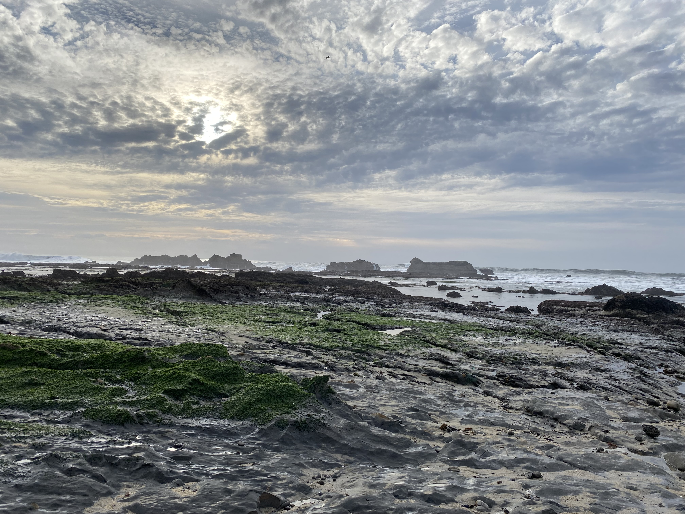

# Maasilan's Page

> _A picture I took at Half Moon Bay._ 

## About Me
***Hello!***
> My name is Maasilan Kumaraguru, and I'm a junior at UCSD.
> In my free time, I enjoy playing video games and hanging out with friends and family.
> My favorite video fame is *Sekiro: Shadows Die Twice*, and the video game I've played the move is 
> probably *Elden Ring*. My favorite drink is Sprite, and a fun fact about me is that I'm a 
> transfer student. I transferred to UCSD from Diablo Valley College which is much closer to Livermore
> where my parents live. In fact, it takes roughly **8 hours** to drive from San Diego to Livermore.

## About Me (Programming Edition)
Currently, I program primarily in C++. However, in high school, I coded my first projects with C# 
in Microsoft Visual Studio!\
My first projects (in sequential order)
1. The first project I remember being excited about was a fighting game I made in Visual Studio
   using C# when I was in 9th grade. (By the way, the game was so bad it was unplayable ... )
2. A minesweeper clone made in python. (The code for this project was lost to time, but it's no
   big deal because I don't remember it working very well ... )
3. A snake game clone I made in python. (At that point in time, this was the closest I had ever come 
   to replicating a game I enjoyed.)\
   [This](pseudoSnakeGameCode.pdf) is a link to the code for the snake game clone I made.\
   Can you believe I made this in 10th grade ... yeah you probably can ... \
   I mean just look at this horrendous code!
   ```
    def valLispop():
      global valLis
      q=-1
      b=0
      for x in range (256):
        permX="X"
        permY="Y"
        q+=1
        if q==16:
          q=0
          b+=1
        b=str(b)
        q=str(q)
        y=permX+b+permY+q
        b=int(b)
        q=int(q)
        valLis.append(y)
   ```
   What is b? What is q? What did I mean by this ... \
   THE HORROR!
4. In community college, I made an elevator simulator with the help of the professor as a class project.

### Project To-Do List
- [ ] Super Secret Programming Project :)
- [ ] polynomial time algorithm for 3SAT

### All of the programming courses I've taken at UCSD so far ... 
[This](https://catalog.ucsd.edu/courses/CSE.html) is a link to the UCSD CSE course catalog. The CSE course catalog gives a brief summary of 
the topics covered in any given UCSD CSE course. A brief summary of all the courses below is 
included in the linked CSE course catalog :).
- CSE 21
- CSE 100R
- CSE 101
- CSE 105
- CSE 110
- CSE 140
- CSE 140L
